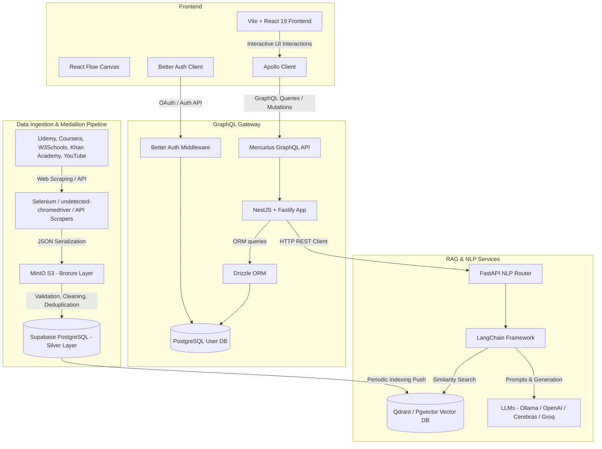

# SkillFlow

SkillFlow is an AI-powered, personalized learning platform that dynamically generates interactive learning roadmaps tailored to a user's specific goals, level, background, and availability.

The platform leverages a **Medallion Data Engineering Pipeline** to collect educational resources from major online learning platforms, indexes them into a **Vector Database**, and utilizes a **RAG (Retrieval-Augmented Generation)** engine to recommend courses, videos, and articles directly inside custom learning paths. It features dynamic comprehension testing (quizzes), remedial learning injection, node-level explanations, and chat-based roadmap adjustments.

---

## Key Features

1. **AI-Driven Roadmap Generation**: Input a topic and receive a series of customization questions. Based on your answers, the RAG engine generates a structured learning path with prerequisites represented as a Directed Acyclic Graph (DAG).
2. **Interactive Canvas**: View and navigate roadmaps dynamically on an interactive node-link canvas powered by **React Flow (@xyflow/react)**.
3. **Smart Resource Integration**: Each learning node is populated with real-world learning resources (Udemy courses, Coursera classes, YouTube videos, and W3Schools tutorials) crawled by the data pipeline.
4. **Node Chat Explainer**: Need a concept explained? Open a node and start a context-aware conversation with the AI specifically about that node's subtopic.
5. **Interactive Quizzing**: Take AI-generated multiple-choice quizzes to verify your understanding. Passing a quiz completes the node and updates your progress.
6. **Remedial Learning Paths**: If you fail a quiz, the system automatically analyzes your mistakes, generates specific remedial subtopics, and injects them into your roadmap as prerequisites.
7. **Conversational Editing**: Modify your roadmap dynamically by telling the AI Assistant to "add a node for advanced testing", "remove intermediate databases", or "re-order my queue".

---

## System Architecture

SkillFlow is built as a monorepo containing multiple decoupled services working together:



---

## Component Interaction Workflows

### 1. Ingestion to Search Index

- **Scrape & Load**: Scrapers parse educational websites and dump raw JSON objects into **MinIO (Bronze Layer)**.
- **Deduplicate & Normalize**: Airflow DAGs validate, clean, and upsert records into **Supabase Postgres (Silver Layer)**.
- **Index Vector DB**: Processed text chunks from courses/lessons are embedded and pushed to **Qdrant/Pgvector** via the FastAPI `/index/push/vector` endpoint, making resources semantically searchable.

### 2. Roadmap Generation & Customization

- **Topic Profiling**: User enters a topic (e.g., "Fullstack React Development") in the frontend. The `web-app` requests customized questions from the `api` (NestJS), which proxies the request to the FastAPI `/roadmap-customization` endpoint.
- **MCQ Questioning**: User answers questions (specifying current knowledge, background, time limits).
- **DAG Generation**: The frontend triggers roadmap creation. FastAPI uses LangChain and the LLM to write a topological sequence of sub-topics. For each sub-topic, it queries the Vector DB for matched courses or videos, streaming the nodes and edges back to NestJS.
- **Storage & Rendering**: NestJS saves the generated roadmap/nodes using Drizzle ORM to Postgres. The frontend displays the roadmap on the React Flow canvas.

### 3. Verification & Remediation

- **Quiz Generation**: User finishes a node and clicks "Take Quiz". The app fetches a dynamically generated MCQ test from the RAG service `/generate-quiz`.
- **Completion Gate**: If the user scores >= 70%, the node status updates to completed in Postgres.
- **Remediation**: If they fail, the user can click "Generate Remedial Path". FastAPI `/generate-remedial` analyzes the incorrect options, creates tailored subtopics, and updates the roadmap in Postgres to link these new nodes as prerequisites.

---

## Technology Stack

| Scope                | Technologies Used                                                                                                                                                                                       |
| :------------------- | :------------------------------------------------------------------------------------------------------------------------------------------------------------------------------------------------------ |
| **Monorepo / Build** | Bun Workspaces, Turborepo, TypeScript, ESLint, Prettier                                                                                                                                                 |
| **Frontend UI**      | React 19, Vite 8, TailwindCSS v4, TanStack Router & Start, Apollo Client, `@xyflow/react` (React Flow), shadcn/ui, Better Auth Client, Lucide React, Streamdown (Markdown), Shiki (Syntax Highlighting) |
| **Backend API**      | NestJS 11, Fastify, Mercurius (GraphQL for Fastify), GraphQL, Drizzle ORM, Better Auth, PostgreSQL (Supabase)                                                                                           |
| **RAG & GenAI**      | FastAPI, Python 3.11, LangChain, Qdrant Client, Supabase (Pgvector), OpenAI API, Groq, Cerebras, Ollama, PyPDF, docx2txt, OpenCV, pytesseract, Pydantic Settings                                        |
| **Data Ingestion**   | Apache Airflow (Astronomer), MinIO, Docker, Selenium + undetected-chromedriver, YouTube Data API v3, Pandas, BeautifulSoup4, Threading                                                                  |

---

## Project Directory Structure

```txt
skillFlow/
├── apps/
│   ├── web-app/                       # Vite + React 19 frontend
│   │   ├── src/routes/                # File-based TanStack Router routes
│   │   ├── src/components/roadmap/    # Canvas rendering, quiz taking, and AI panels
│   │   └── src/components/ui/         # Shared UI components (shadcn/ui)
│   ├── api/                           # NestJS GraphQL Gateway API
│   │   ├── src/database/              # Drizzle configuration and schemas
│   │   └── src/modules/               # Modular services (roadmap, node, quiz, user)
│   ├── Genration roadmap (RAG)/       # Python FastAPI RAG Service (Note directory spelling)
│   │   ├── src/controllers/           # NLP orchestration, templates, document loaders
│   │   ├── src/routes/                # API endpoints (data, nlp, base)
│   │   └── src/stores/                # VectorDB, LLM, and Embedding providers
│   └── data-pipline/                  # Airflow Orchestration & Scrapers (Note directory spelling)
│       ├── dags/                      # Airflow DAGs (bronze and silver ingestion)
│       ├── scrape/                    # Multi-platform crawlers (Udemy, Coursera, etc.)
│       └── include/                   # Upload utility modules for Bronze/Silver
├── packages/
│   ├── eslint-config/                 # Shared ESLint parameters
│   └── typescript-config/             # Base TypeScript tsconfig profiles
├── package.json                       # Monorepo workspaces definition
├── bun.lock                           # Lockfile for Bun workspaces
└── turbo.json                         # Turborepo task runner configuration
```

---

## Setup & Execution

### Prerequisites

- [Bun](https://bun.sh/) (>= 1.3.11)
- [Python](https://www.python.org/) (3.11+)
- [Docker Desktop](https://www.docker.com/products/docker-desktop/) (for Airflow and MinIO)
- An active PostgreSQL database (e.g., Supabase) and Qdrant database (or Pgvector client)
- API Keys: OpenAI, Groq, or local Ollama instances.

---

### Step 1: Clone the Repository

```bash
git clone <repository-url>
cd skillFlow
```

---

### Step 2: Running Frontend & API Gateway (Bun Workspaces)

1. **Install JavaScript dependencies** from the root directory:

   ```bash
   bun install
   ```

2. **Configure Environment Variables**:
   - In [apps/api/.env](file:///D:/projects/skillFlow/apps/api/.env):

     ```env
     PORT=3001
     NODE_ENV=development
     DATABASE_URL="postgresql://<user>:<password>@<host>:<port>/postgres"
     DIRECT_DATABASE_URL="postgresql://<user>:<password>@<host>:<port>/postgres"
     BETTER_AUTH_SECRET="your-better-auth-secret-here"
     BETTER_AUTH_URL="http://localhost:3001"
     BETTER_AUTH_CALLBACK_URL="http://localhost:3001/api/auth/callback"
     WEB_URL=http://localhost:3000
     RAG_URI=http://localhost:8000/api/v1
     GOOGLE_CLIENT_ID="your-google-oauth-client-id"
     GOOGLE_CLIENT_SECRET="your-google-oauth-client-secret"
     ```

   - In [apps/web-app/.env](file:///D:/projects/skillFlow/apps/web-app/.env):
     ```env
     VITE_SERVER_URL=http://localhost:3001
     VITE_BETTER_AUTH_URL=http://localhost:3001/api/auth
     GRAPHQL_URL=http://localhost:3001/graphql
     GROQ_API_KEY="your-groq-key-here"
     # VITE_GRAPHQL_WS_URL=ws://localhost:3001/graphql
     ```

3. **Database Migration**:
   To push the schema definitions to your Postgres database:

   ```bash
   cd apps/api
   bun db:push
   ```

4. **Launch Dev Servers**:
   Return to the repository root and start the web app and API backend:
   ```bash
   cd ../..
   bun dev
   ```

   - **Frontend App**: [http://localhost:3000](http://localhost:3000)
   - **GraphQL Playground**: [http://localhost:3001/graphql](http://localhost:3001/graphql)

---

### Step 3: Running the RAG Engine (FastAPI)

1. Navigate to the RAG workspace:

   ```bash
   cd "apps/Genration roadmap (RAG)/src"
   ```

2. **Set up a Virtual Environment** and activate it:

   ```bash
   python -m venv venv
   # On Windows:
   venv\Scripts\activate
   # On macOS/Linux:
   source venv/bin/activate
   ```

3. **Install Requirements**:

   ```bash
   pip install torch --index-url https://download.pytorch.org/whl/cpu
   pip install -r requirements.txt
   ```

4. **Configure Environment Variables**:
   Create a `.env` file in the `src` directory based on the `.env.example`:

   ```env
   APP_NAME="SkillFlow-RAG"
   APP_VERSION="1.0.0"

   # Provider configurations
   GENERATION_CLIENT="groq" # Options: openai, groq, gemini, cerebras
   EMBEDDING_CLIENT="openai"
   VECTOR_DB_CLIENT="qdrant" # Options: qdrant, pgvector

   # Key Settings
   OPENAI_API_KEY="your-openai-api-key"
   GROQ_API_KEY="your-groq-api-key"

   # Vector Database Settings
   QDRANT_URL="http://localhost:6333"
   QDRANT_API_KEY="your-qdrant-api-key"
   VECTOR_DB_PATH="./assets/vectors"

   # Supabase/Pgvector Settings (Optional if Qdrant is selected)
   SUPABASE_URL="https://your-project.supabase.co"
   SUPABASE_KEY="your-supabase-anon-key"
   ```

5. **Start RAG Server**:
   ```bash
   uvicorn main:app --reload --port 8000
   ```

   - **API Docs**: [http://127.0.0.1:8000/docs](http://127.0.0.1:8000/docs)

---

### Step 4: Running the Ingestion Pipeline (Airflow & MinIO)

1. Navigate to the pipeline workspace:

   ```bash
   cd apps/data-pipline
   ```

2. **Launch Services** (Requires Docker):
   If you have the Astronomer CLI installed:

   ```bash
   astro dev start
   ```

   Alternatively, run the containers directly:

   ```bash
   docker-compose up -d
   ```

3. **Access Service UIs**:
   - **Airflow Console**: [http://localhost:8080](http://localhost:8080) (Credentials: `admin`/`admin`)
   - **MinIO Console**: [http://localhost:9001](http://localhost:9001) (Credentials: `minioadmin`/`minioadmin`)

4. **Trigger Crawling & Ingestion**:
   - Open the Airflow UI, locate the `bronze_ingestion` DAG, enable it, and click **Trigger**.
   - Once Bronze is fully populated in MinIO, enable and trigger the `silver_ingestion` DAG to clean and upsert resources to Supabase Postgres.
   - Pushing the data to the RAG vector index can be initiated by uploading the resulting course chunk files to the RAG API.

---

## API Endpoints Overview (FastAPI RAG Service)

### NLP & Search

- `POST /api/v1/nlp/index/push/vector` - Index a processed JSON course file into the vector collection.
- `POST /api/v1/nlp/index/search` - Semantically search courses and tutorials by keyword.
- `POST /api/v1/nlp/index/answer` - General RAG QA endpoint.

### Roadmap Flow

- `POST /api/v1/nlp/roadmap-customization` - Generates user customization questions for a given topic.
- `POST /api/v1/nlp/generate-roadmap-rag` - Generates a full prerequisite DAG of learning nodes for the user.
- `POST /api/v1/nlp/edit-roadmap-rag` - Iteratively edits a roadmap canvas based on user feedback.
- `POST /api/v1/nlp/explain-node` - Answers user questions regarding the content of a single node.

### Learning Control

- `POST /api/v1/nlp/generate-quiz` - Produces multiple-choice questions to test understanding of a node.
- `POST /api/v1/nlp/generate-remedial` - Generates prerequisite remedial subtopics for incorrect quiz submissions.

---

## Development Commands

From the monorepo root:

- `bun dev` - Run both apps (`api` & `web-app`) in parallel development mode.
- `bun build` - Build all codebases.
- `bun lint` - Lint the codebase for formatting and structural rules.
- `bun format` - Format workspace codebases with Prettier.
